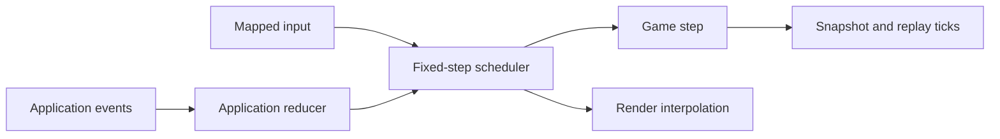

# Morphe v0.1 runtime contracts

Morphe provides fixed updates, application control, and deterministic replay. The core remains pure; GLFW and clock
access remain in the LWJGL adapter.

## Runtime flow



## Fixed-step scheduler

`morphe.fixed-step` schedules `morphe.core/step` without reading a clock.

```clojure
(def loop-state
  (fixed-step/create game-state
                     {:update-hz            60
                      :max-catch-up-updates 5
                      :max-frame-seconds    0.25}))

(fixed-step/advance loop-state sources elapsed-seconds mapped-events)
;; => {:loop next-loop-state
;;     :effects [...]
;;     :updates 1
;;     :alpha 0.42
;;     :dropped-seconds 0.0
;;     :ticks [{:tick 18 :events [...]}]}
```

The loop state contains the current game, previous game, accumulator, pending events, tick number, and options. It is
immutable and contains no platform objects.

`advance` clamps elapsed time and calculates due updates. It runs at most `:max-catch-up-updates` and reports discarded
time in `:dropped-seconds`.

Pending mapped events run once on the first due update. Later catch-up updates receive no repeated input. Sources run on
every update with `1 / update-hz` seconds.

Effects and tick records retain update order. Events remain pending if no update is due.

The result's `:alpha` is the remaining fraction of one update. LWJGL also supplies the previous game through render
context.

```clojure
(let [previous (fixed-step/previous-entity-state render-context)
      alpha (:morphe.render/alpha render-context)]
  (fixed-step/interpolate-number (:x previous) x alpha))
```

`reset-timing` clears accumulated time and pending gameplay input after a pause or clock reset. `queue-events` adds
mapped events without advancing time.

## Application events and controls

`morphe.application` uses four event shapes:

```clojure
{:type :morphe.app/quit-requested}
{:type :morphe.app/focus-changed :focused? false}
{:type :morphe.app/resized :width 1280 :height 720}
{:type :morphe.app/content-scale-changed :content-scale {:x 2.0 :y 2.0}}
```

The LWJGL `:app-event-fn` receives application data, game state, and one event. It returns updated data, mapped game
events, and ordered controls.

```clojure
(fn [app-state game-state app-event]
  {:app      app-state
   :events   [(game/event [:ui/window-changed app-event])]
   :controls [[:app/pause]]})
```

Controls are `[:app/quit]`, `[:app/cancel-quit]`, `[:app/pause]`, and `[:app/resume]`.

Close requests quit unless the callback cancels them. Focus changes only update focus by default. A game may pause on
focus loss through its callback.

The adapter continues rendering and handling application events while paused. It resets simulation timing and ignores
gameplay input until resume.

Framebuffer resize events update application dimensions. Content-scale events update `:content-scale`. LWJGL updates the viewport before the next render.

`:error-fn` receives a fatal throwable and phase data. It returns `:close` or `:rethrow`; the default is `:rethrow`.
Native cleanup runs before `start!` returns or rethrows.

## Replay format

`morphe.replay` records mapped events at the simulation tick that consumes them.

```clojure
{:morphe.replay/version 1
 :update-hz             60
 :initial-snapshot      {...}
 :ticks                 [{:tick 1 :events [...]}
                         {:tick 2 :events [...]}]
 :final-snapshot        {...}}
```

| Function           | Contract                                                               |
|--------------------|------------------------------------------------------------------------|
| `start-recording`  | Validates and stores an initial snapshot and update rate               |
| `record-ticks`     | Appends sequential tick records returned by `fixed-step/advance`       |
| `finish-recording` | Validates and attaches the expected final snapshot                     |
| `play`             | Restores, applies every recorded tick, and verifies the final snapshot |

Recordings are EDN-safe and require typed entities. Restore factories rebuild entity handlers, components, and renderers
from saved state.

Raw keyboard, mouse, and controller events are excluded. Input mapping defines the replay boundary.

`morphe.random` supplies deterministic xoshiro128** state. `create` accepts a signed or unsigned 32-bit seed.
`next-uint`, `next-int`, and `next-double` return `[next-state value]`.

Store random state in game context or typed entity state. External entropy must enter through a mapped event if replay
must reproduce it.

Replay compatibility covers the same game build and snapshot schema.

## LWJGL integration

`morphe.adapters.lwjgl/start!` accepts these runtime options:

| Option                  | Contract                                                    |
|-------------------------|-------------------------------------------------------------|
| `:update-hz`            | Positive integer simulation rate; defaults to `:frame-rate` |
| `:max-catch-up-updates` | Positive integer update bound; defaults to 5                |
| `:max-frame-seconds`    | Positive accepted frame-time bound; defaults to 0.25        |
| `:input-fn`             | Returns mapped events or `{:events [...] :controls [...]}`  |
| `:app-state`            | Initial plain data passed to application callbacks          |
| `:app-event-fn`         | Handles close, focus, and resize events                     |
| `:error-fn`             | Chooses `:close` or `:rethrow` for fatal errors             |
| `:event-fn`             | Observes completed frames, including replay tick records    |

The adapter adds `:morphe.render/alpha` and `:morphe.render/previous-game` to the configured render context.

## Validation coverage

| Contract                | Evidence                                                                                                                           |
|-------------------------|------------------------------------------------------------------------------------------------------------------------------------|
| Fixed updates           | Scheduler tests cover pending input, exact updates, catch-up limits, dropped time, timing reset, and equivalent elapsed partitions |
| Interpolation           | Helper tests and platformer renderers use previous entity state and alpha                                                          |
| Application control     | Reducer tests cover quit, close cancellation, pause, resume, focus, resize, callback output, and fatal-error decisions             |
| Replay                  | Core tests cover EDN round trips, ordered ticks, deterministic random state, mismatch errors, and malformed recordings             |
| Frame-rate independence | The platformer reaches equal snapshots after one second at 30, 60, and 144 rendered FPS                                            |
| Cross-platform core     | The ClojureScript smoke test exercises application state, fixed updates, replay, and the random golden sequence                    |

Run the complete release pipeline from the repository root:

```sh
clojure -T:build ci :version '"0.2.0-test"'
```

Run a short runtime benchmark from `modules/morphe-next`:

```sh
clojure -M:benchmark --quick
```

## Compatibility decisions

| Topic           | Contract                                                         |
|-----------------|------------------------------------------------------------------|
| Tick assignment | Mapped input waits for the next update and is consumed once      |
| Pause policy    | Focus loss pauses only when the application callback requests it |
| Replay scope    | Recordings reproduce the same game build and snapshot schema     |
| Randomness      | Snapshot state owns deterministic random progress                |
